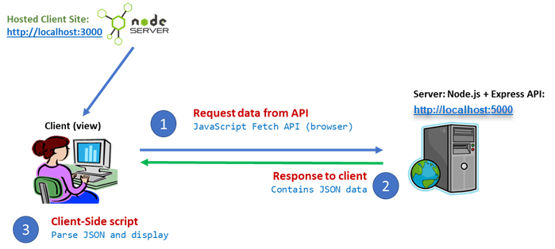
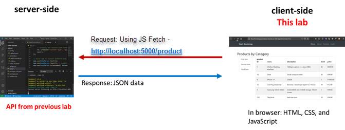
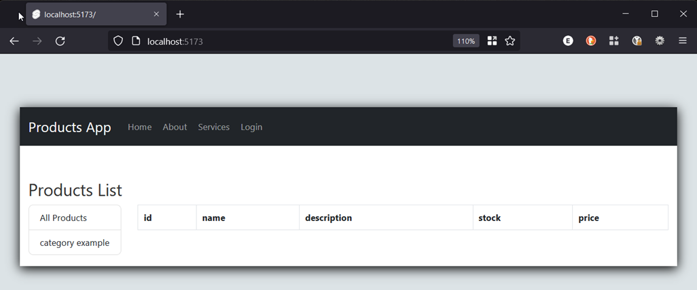
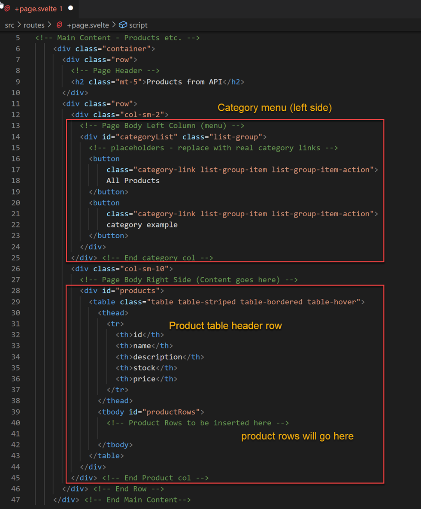
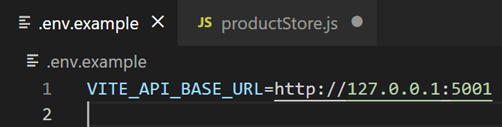
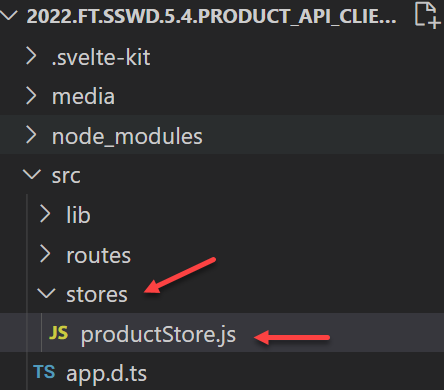
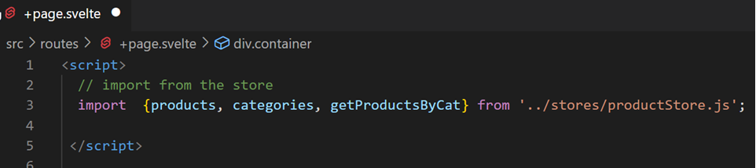
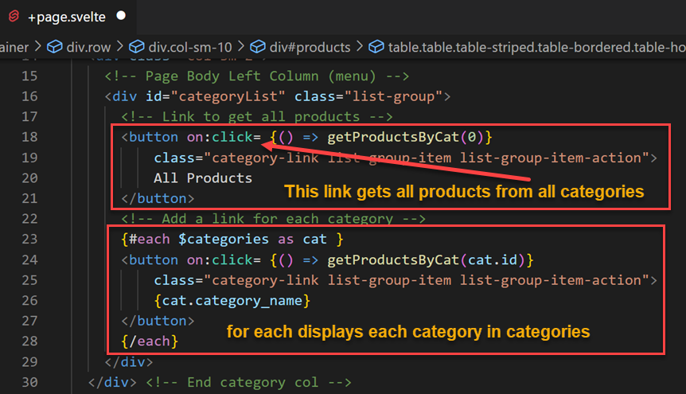

# Web API Client: Part 1 - display products

Enda Lee 2022

### Quick Start

1. Make sure the `Server API` app is running on http://localhost:5001
2. Download the start site from this repository.
3. Open in VS Code (separate to the server API instance).
4. In a terminal run `npm install`.
5. Start the application using `npm run start`.


## Introduction

This tutorial will use SvelteKit to create a client website which will uses the JavaScript Fetch API to request and display data from the web API created previously. Please note that port numbers used later are different to the one onnes shown in the diagram.




## 1. Pre-requisites

The application will use **separate** **`client`** and **`server`** applications which should be opened in separate VS Code instances when working on this lab.

##### Server-side

The client functionality is dependent on a server API with Category and Product endpoints. Make sure that the server API is running and listening on http://localhost:5001




The client site/ application will fetch its data from the server-side API running on http://localhost:5001


## 2. Site structure

#### 2.1. Site root

When http://localhost:5173 loads first, the empty default page looks like the following. 




This page will act as a template for displaying category and product details. It is served from **`srd/routes/+page.svelte`**

After the products are retrieved, they will be displayed in the `HTML table`. The table body, which has `id="productRows"` will be populated using `JavaScript`. The product data will be requested from the API.




#### 2.2  Page Layout

**`+layout.svelte`** defines the common layout and navigation elements shared by all of the pages in the site. The **`routes`** folder includes a number of sample pages including login, about, and services.

Styling is based on **Bootstrap 5.2** which is loaded in **`app.html`**, with additional css defined in **`static\css\style.css`**.

#### 2.3 .env
Rename **`.env.example`** to **`.env`**. It defines the **`base_url`** of the server API.




## 3. Retrieving data from the Server API

In this section we will add functionality to get and store data from the API. It is assumed that the server API is running n http://localhost:5001 with endpoints to return **all categories**, **all products**, and **products by category id**

#### 3.1. Add a SvelteKit store

The framework includes the **store** feature to manage and persist data and session state in the application. Add a folder named **stores** to the **`src`** folder. Then add **`productStore.js`** to  **`stores`**:

 


The store script defines two writable store objects for product and category  plus the functions which will be used to fetch data from the API. Read the comments for details. 

**`productStore.js`** code:

```javascript
// import dependencies
import { writable } from 'svelte/store';

// .env variables starting with VITE_ are accessible client and server side 
const base_url = import.meta.env.VITE_API_BASE_URL

// two writable stores for products and categories
export const products = writable([]);
export const categories = writable([]);


// Function to get all products
// base_url is defined in .env

export const getAllProducts = async () => {

    try {
        const response = await fetch(`${base_url}/product`);
        const data = await response.json();
        console.log(data);

        // update the writable store with the product data retrieved
        products.set(data);
    } catch (err) {
        // @ts-ignore
        console.log('getAllProducts() error (store) ', err.message);
    } finally {

    }
}

// Get all categories
export const getAllCategories= async () => {

    try {
        const response = await fetch(`${base_url}/category`);
        const data = await response.json();
        console.log(data);

        // update the writable store with the category data retrieved
        categories.set(data);
    } catch (err) {
        // @ts-ignore
        console.log('getAllCategories() error (store) ', err.message);
    } finally {

    }        

}

// Get products by category id
export const getProductsByCat = async (cat_id = 0) => {

    // If a category id > 0 is provided
    if (cat_id > 0) {

        try {
            const response = await fetch(`${base_url}/product/bycat/${cat_id}`);
            const data = await response.json();
            console.log(data);

            // update the writable store with the product data retrieved
            products.set(data);
        } catch (err) {
            // @ts-ignore
            console.log('getProductsByCat(cat_id) error (store) ', err.message);
        } finally {
    
        }

    // otherwise get all products    
    } else {
        getAllProducts();
    }
}

// call the functions to initialise the store
getAllProducts();
getAllCategories();

```


## 4. Displaying the data

Product and Category data will be displayed in the default page, **`src\routes\+page.svelte`**, as described above.

First, the stores and other dependencies must be imported into the page.




#### 4.1 Display Categories

The **categories store** contains everything from the the category table in the database (provided by the API). We can iterate through the list and display. each as a link in the left menu of the page.

Note too the All categories link.




When the button links are clicked (`on:click`) the `getProductsByCat()` function is called, passing the `category id` as a parameter. This allows he list of products to be filtered.

Also note the **`$`** symbol before categories in line 23. This means that the page can listen for changes to the categories store and update the view.


#### 4.2 Display Products

This is similar to categories.  Again there is a subscription to  **`$products`** so that the page is updated whenever the store updates. You will see this when a category link is clicked.

``` html
          <div id="products">
            <table class="table table-striped table-bordered table-hover">
              <thead>
                <tr>
                  <th>id</th>
                  <th>name</th>
                  <th>description</th>
                  <th>stock</th>
                  <th>price</th>
                </tr>
              </thead>
              <tbody id="productRows">
                <!-- Product Rows to be inserted here -->
                {#each $products as product }
                <tr>
                    <td>{product.id}</td>
                    <td>{product.product_name}</td>
                    <td>{product.product_description}</td>
                    <td>{product.product_stock}</td>
                    <td class="price">&euro;{Number(product.product_price).toFixed(2)}</td>
                </tr>
                {/each}
              </tbody>
            </table>
          </div>
```


## Test the Application

First **open and start the server API app**, so that it is running and ready for http connections. Then start the SvelteKit ap.

In a web browser, open http://localhost:5173. The page should load and display the data.

Check for details in the browser console where you will say the result of any logging, errors, etc.


------

Enda Lee 2022
